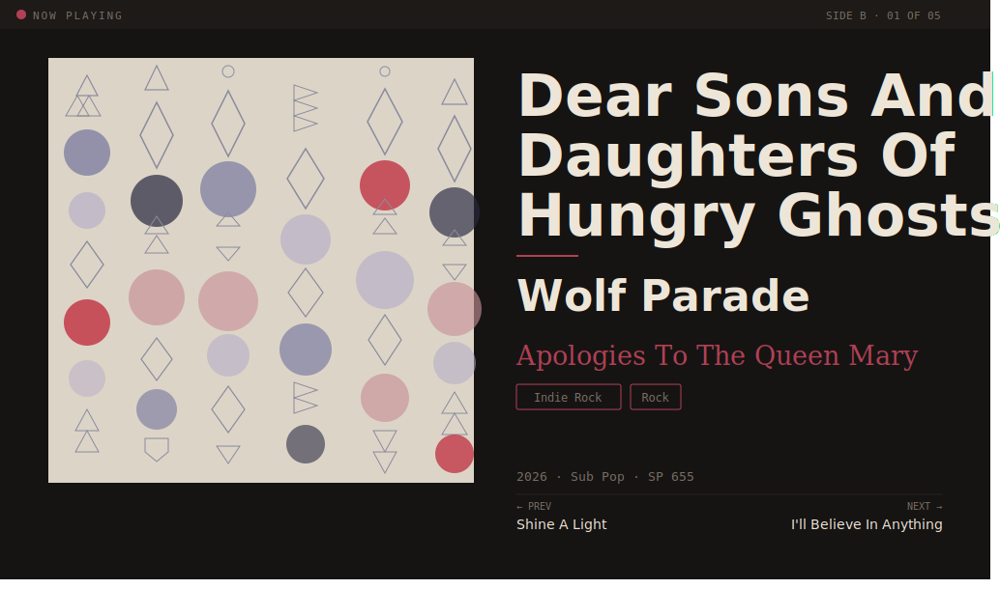

# vinyl-now-playing

[](VERSION)

A Raspberry Pi app that listens to a vinyl record playing through a USB audio interface, identifies the current track via audio fingerprinting, enriches it with metadata from your Discogs collection, and displays the artist, album, track name, and cover art on an HDMI-connected LCD screen.

When the last track of an album finishes, it automatically increments the Play Count and records the Last Played date for that record in your Discogs collection, and scrobbles the session to Last.fm.

## Now Playing Screen



## Features

- 🎵 Real-time audio fingerprinting via ShazamIO (no manual input needed)
- 💿 Discogs collection-first metadata — pulls your specific pressing's details
- 🖼️ "Museum Card" display layout: large cover art, hero track title, artist, italic album name, genre/style chip badges, side indicator, prev/next track footer
- 🎨 Dynamic color theming — palette extracted from each album's cover art; background, accent, and text colors shift per record with a smooth 1-second transition
- ✅ Automatically increments Play Count in Discogs when the last track plays
- 📅 Optionally records Last Played date (ISO 8601) in a Discogs custom field
- 🎧 Last.fm scrobbling — every identified track posted to your listening history automatically
- ❤️ Optional Last.fm "Loved" mark when a full album side completes (configurable, off by default)
- 🔄 Graceful fallback: Discogs collection → Discogs database → MusicBrainz
- 🔧 Swappable recognition backend (ShazamIO, ACRCloud, AudD)

## Hardware

- Raspberry Pi 4 Model B (4GB recommended)
- USB audio interface (e.g. Behringer UCA222) connected to your turntable preamp's line-level output
- HDMI LCD screen — built and tested with Waveshare 7" HDMI LCD (H) at 1024×600

## Setup

```bash
git clone https://github.com/lanebecker/vinyl-now-playing.git
cd vinyl-now-playing
pip install -r requirements.txt
cp config.example.yaml config.yaml
# Edit config.yaml with your Discogs token, username, and audio device
python main.py
```

## Configuration

Copy `config.example.yaml` to `config.yaml` and fill in:

- `discogs.user_token` — from https://www.discogs.com/settings/developers
- `discogs.username` — your Discogs username
- `audio.device_name` — run `python -c "import sounddevice; print(sounddevice.query_devices())"` to find your USB interface name
- `discogs.play_count_field_name` — the exact name of your Play Count custom field (default: `"Play Count"`)
- `discogs.last_played_field_name` — optional; the exact name of a Last Played custom field in your Discogs collection. If set, today's date is written in `YYYY-MM-DD` format on each album completion.
- `lastfm.scrobble_enabled` — set to `true` to enable Last.fm scrobbling; also fill in `api_key`, `api_secret`, and `session_key`. Run `python get_lastfm_session_key.py` to generate your session key.

## Documentation

- [Architecture](docs/architecture.md) — full system design, component reference, data flows
- [Roadmap](docs/roadmap.md) — planned features and versioning
- [Changelog](CHANGELOG.md) — what changed in each version
- [Testing guide](docs/testing-guide.md) — running the unit and integration test suites
- [Pi setup guide](docs/pi-setup-guide.md) — hardware bring-up from bare Pi to running app
- [Hardware guide](docs/hardware-guide.md) — wiring diagram and parts list

## Inspired By

- [VinylPi64](https://github.com/simontrost/VinylPi64) by simontrost
- [shazampi-eink](https://github.com/ravi72munde/shazampi-eink) by ravi72munde

## License

MIT
